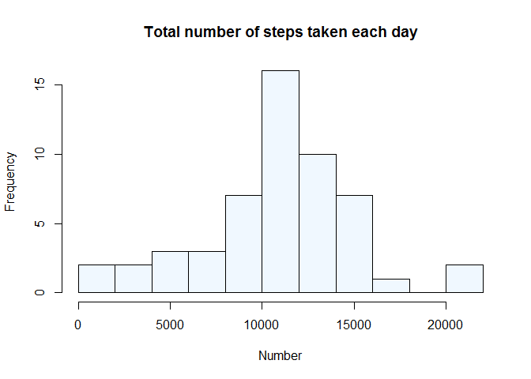

# Reproducible Research: Peer Assessment 1


#### Loading and preprocessing the data
Note: this project is a clone of <<https://github.com/rdpeng/RepData_PeerAssessment1>>

```r
knitr::opts_chunk$set(cache=F)
Sys.setlocale("LC_TIME", "English")
```

```
## [1] "English_United States.1252"
```

```r
unzip("activity.zip")
act<- read.csv("activity.csv", stringsAsFactors=F)
# Converting "date" column to the appropriate format
act$date<- as.Date(act$date, "%Y-%m-%d")
```

#### What is mean total number of steps taken per day?

1. Calculate the total number of steps taken per day

```r
act_compl<- act[complete.cases(act),]
steps_pday_total <- tapply(act_compl$steps, act_compl$date, sum)
```
2. Make a histogram of the total number of steps taken each day

```r
hist(steps_pday_total, breaks=8, col="aliceblue", main="Total number of steps taken each day", xlab="Number")
```

 

```r
dev.copy(png, "figure/plot1.png")
```

```
## png 
##   3
```

```r
dev.off()
```

```
## png 
##   2
```
3. Calculate and report the mean and median of the total number of steps taken per day

```r
mymean<- round(mean(steps_pday_total))
mymean
```

```
## [1] 10766
```

```r
mymedian<- median(steps_pday_total)
mymedian
```

```
## [1] 10765
```
The mean of total number of steps taken per day is 1.0766\times 10^{4}. The median is 10765.

#### What is the average daily activity pattern?

1. Make a time series plot of the 5-minute interval and the average number of steps taken, averaged across all days

```r
steps_pint_av<- round(tapply(act_compl$steps, act_compl$interval, mean))
# As someone noticed on the duscussion board, it is important to turn the integer intervals into time format to avoid artifacts on the plot.
mytime<- strptime(sprintf("%04d", as.numeric(names(steps_pint_av))), format="%H%M")
plot(mytime, steps_pint_av, type="l", main="Average number of steps taken per interval", xlab="Time", ylab="Number")
```

 

```r
dev.copy(png, "figure/plot2.png")
```

```
## png 
##   3
```

```r
dev.off()
```

```
## png 
##   2
```
2. Which 5-minute interval, on average across all the days in the dataset, contains the maximum number of steps?

```r
myindex<- which.max(steps_pint_av)
# 'myindex' is only an ordinal number.
myvalue<- mytime[myindex]
myvalue<- format(myvalue, format="%H:%M")
```
The 08:35 interval contains the maximum number of steps.

#### Imputing missing values

1. Calculate and report the total number of missing values in the dataset (i.e. the total number of rows with NAs)

```r
act_mis<- act[!complete.cases(act),]
nrow(act_mis)
```

```
## [1] 2304
```
Total number of missing values in the dataset is 2304.

2. How do we impute missing values? It seems reasonable to use the mean for a given 5-minute interval, since activity pattern within a given day is more regular than between days (take a look at the next plot).

```r
steps_pday_av<- tapply(act$steps, act$date, mean, na.rm=T)
plot(steps_pday_av, type="l", main="Av. number of steps per day", xlab="Day index")
```

 

```r
# Indices could be turned into days themselves, but it's not the most important part here
dev.copy(png, "figure/plot3.png")
```

```
## png 
##   3
```

```r
dev.off()
```

```
## png 
##   2
```
3. Create a new dataset that is equal to the original dataset but with the missing data filled in.

It seems there were several dates in which none of the measurements were taken. If it's true, number of missing values should be divisible by number of intervals. Let's check it.

```r
nrow(act_mis)/length(steps_pint_av)
```

```
## [1] 8
```
Indeed. Then we can check whether all the intervals are present and ordered in the `act_mis` dataset.

```r
all(act_mis$interval==names(steps_pint_av))
```

```
## [1] TRUE
```
We can directly impute a vector with mean numbers of steps per interval into the data frame with missing values.

```r
myimp<- rep(steps_pint_av, 8)
act_mis$steps<- myimp
act1<- rbind(act_compl, act_mis)
# We can reorder the dataset to make it look perfectly identical with the previous one
act1<- act1[order(act1$date, act1$interval),]
head(act1)
```

```
##   steps       date interval
## 1     2 2012-10-01        0
## 2     0 2012-10-01        5
## 3     0 2012-10-01       10
## 4     0 2012-10-01       15
## 5     0 2012-10-01       20
## 6     2 2012-10-01       25
```

4. Make a histogram of the total number of steps taken each day. Calculate and report the mean and median total number of steps taken per day. Do these values differ from the estimates from the first part of the assignment?

```r
steps_pday_total <- tapply(act1$steps, act1$date, sum)

hist(steps_pday_total, breaks=8, col="aliceblue", xlab="Number",
     main="Total number of steps taken each day with NAs filled")
```

 

```r
dev.copy(png, "figure/plot4.png")
```

```
## png 
##   3
```

```r
dev.off()
```

```
## png 
##   2
```
Histogram is more peaked comparing to the previous one. It's not surprising since we plugged in a lot of mean values, and more observations are now concentrated around the center of the distrubution.

```r
mymean1<- round(mean(steps_pday_total))
mymean1
```

```
## [1] 10766
```

```r
mymedian1<- median(steps_pday_total)
mymedian1
```

```
## [1] 10762
```
Recall that previously the mean was 1.0766\times 10^{4} and the median was 10765.
Neither the mean nor the median show significant changes, for the reason mentioned above. 

#### Are there differences in activity patterns between weekdays and weekends?

```r
# Create a variable with weekday/weekend indicator
wd<- weekdays(act1$date, abbreviate=T)
wd[wd %in% c("Sat", "Sun")] <- "weekend"
wd[wd!="weekend"]<- "weekday"
act1$wd<- wd

# Find the mean step number by weekdays and intervals
library(dplyr)
```

```
## 
## Attaching package: 'dplyr'
## 
## The following object is masked from 'package:stats':
## 
##     filter
## 
## The following objects are masked from 'package:base':
## 
##     intersect, setdiff, setequal, union
```

```r
act1<- tbl_df(act1)
act1<- summarise(group_by(act1, wd, interval, add=T), steps=round(mean(steps)))

# Turn the integer intervals to time variable
mytime<- strptime(sprintf("%04d", act1$interval), format="%H%M")
act1$time<- mytime
act1<- data.frame(act1)

library(lattice)
xyplot(steps~interval | wd, data=act1, layout=c(2,1), type="l", ylab="Number", xlab="interval", main="Average number of steps grouped by weekdays")
```

 

```r
dev.copy(png, "figure/plot5.png")
```

```
## png 
##   3
```

```r
dev.off()
```

```
## png 
##   2
```
